# Tutorial de Anotação

Nesse repositório está o tutorial de como anotar os documentos do Diário Oficial do Distrito Federal (DODF) de acordo com os requisitos do Tribunal de Contas do Distrito Federal (TCDF).

A ferramenta usada para realizar as anotações será o [TeamTat](https://www.teamtat.org/). Essa é uma ferramenta online para anotação que permite que várias pessoas anotem e revisem um mesmo documento facilitando a geração de uma base de dados padrão ouro.

A anotação dos documentos do DODF será feita a nível de atos de entidades. Os atos as serem anotados estão apresentados a seguir e as respectivas entidades estão nos tutoriais individuais dos atos.

*   [Exoneração](ato_exoneracao/exoneracao.md)
*   [Nomeação](ato_nomeacao/nomeacao.md)
*   [Ato tornado sem efeitos](ato_tornado_sem_efeito/ato_tornado_sem_efeito.md)
*   [Retificação](ato_retificacao/retificacao.md)
*   [Aposentadoria](ato_aposentadoria/aposentadoria.md)
*   [Reversão](ato_reversao/reversao.md)
*   [Abono de permanência](ato_abono_permanencia/abono_permanencia.md)
*   [Retificação](ato_retificacao)
*   [Substituição de Funções](ato_substituicao)
*   [Cessão](ato_cessoes/cessoes.md)
*   [Reposicionamento de Lista de Classificação](ato_reposiscionametno/reposicionamento)

Vamos começar!

Primeiramente, é fornecida uma URL única para o anotador. Com ela, é possível acessar os projetos e os documentos a serem anotados, portanto, é importante salvá-la em um lugar em que possa ser acessada posteriormente. 

Ao acessar a URL, o anotador é direcionado para a página de perfil de usuário do TeamTat, em que é possível modificar seu nome de usuário e enviar a URL de acesso por e-mail.

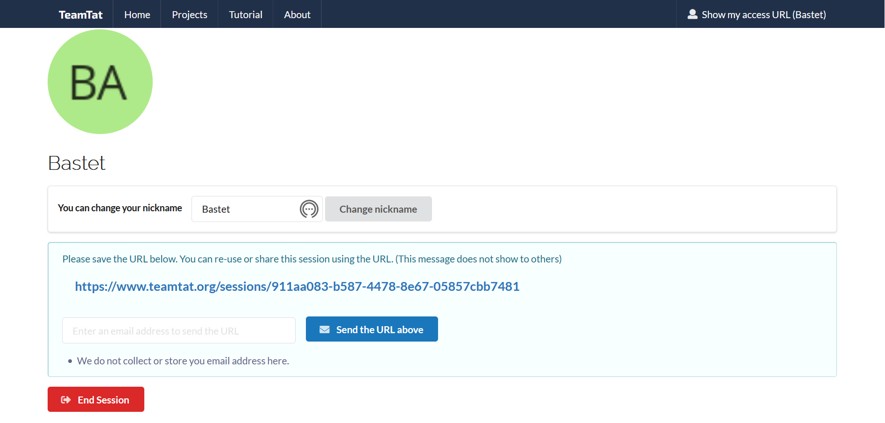

Para acessar os documentos a serem anotados, basta clicar em "Projects" e, em seguida, no projeto referente ao documento desejado. 

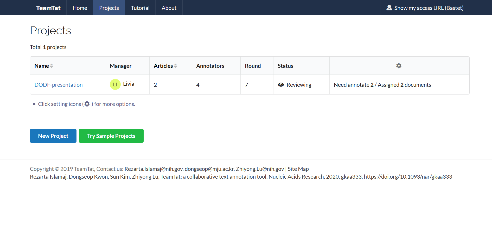

Os rótulos usados para a anotação estão diponíveis na aba "Types".

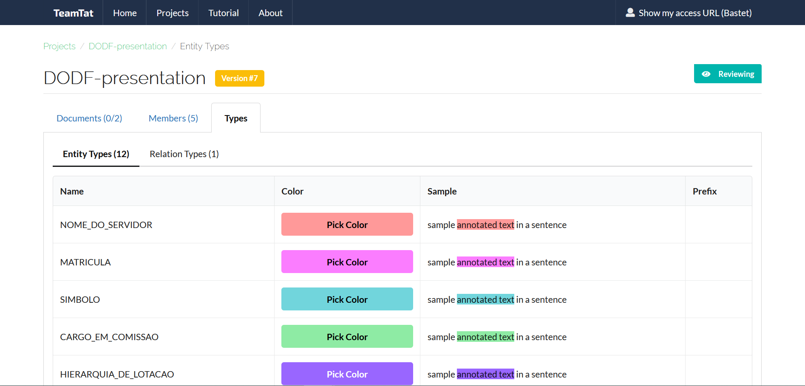

Vamos começar a anotar!

Para encontrar os atos a serem anotdados no documento, pesquise, pressionando CTRL+F, a palavra chave do ato em questão. Este tutorial mostra a anotação de um ato de exoneração como exemplo, então será pesquisada a palavra "exonerar". A pesquisa também indicará quantos atos desse tipo existem no documento.

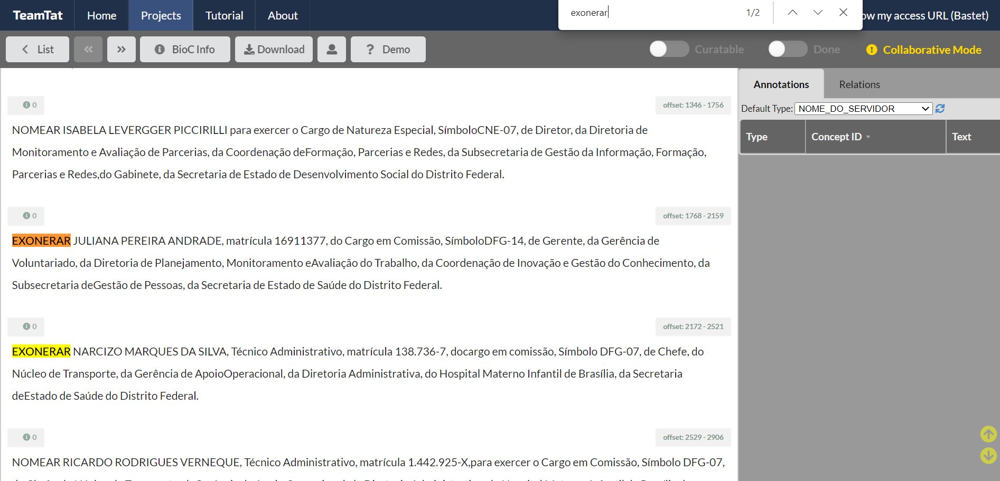

Após isso, as entidades serão anotadas. Se existirem poucos atos do tipo escolhido no documento, 20 ou menos, é recomendado anotar uma entidade por vez, ou seja, anote todos os nomes de servidores do documento,  todas as matrículas do documento e assim por diante. Caso haja muitos atos, é recomentado anotar as entidades por parágrafo. 

Para fazer a anotação em si, escolha qual a entidade deve ser anotada e selecione seu rótulo na aba esquerda da tela. Então, com o mouse, selecione o texto correspondente a esse rótulo. 

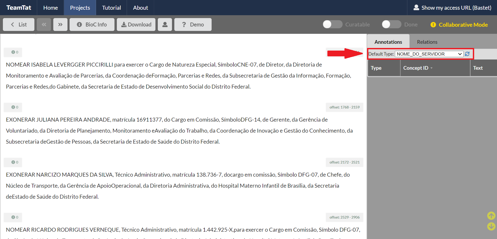

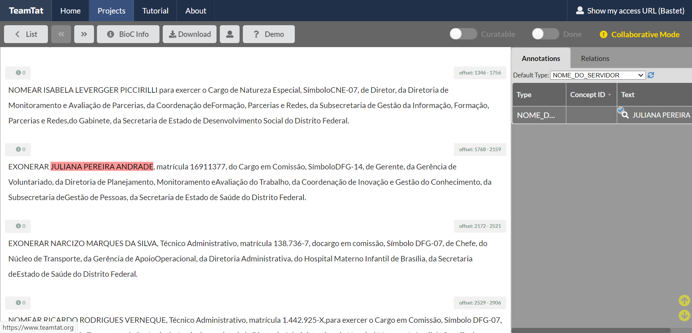

O texto selecionado ficará grifado com a cor correspondente ao rótulo escolhido.

Após anotar as entidades do ato, é necessário anotar o ato completo. Para isso, escolha o rótulo do ato na aba esquerda e selecione o texto correspondente. Uma tela pop-up irá aparecer, pois já existem anotações no texto selecionado. Nessa tela, escolha a opção "Create New Annotation". 

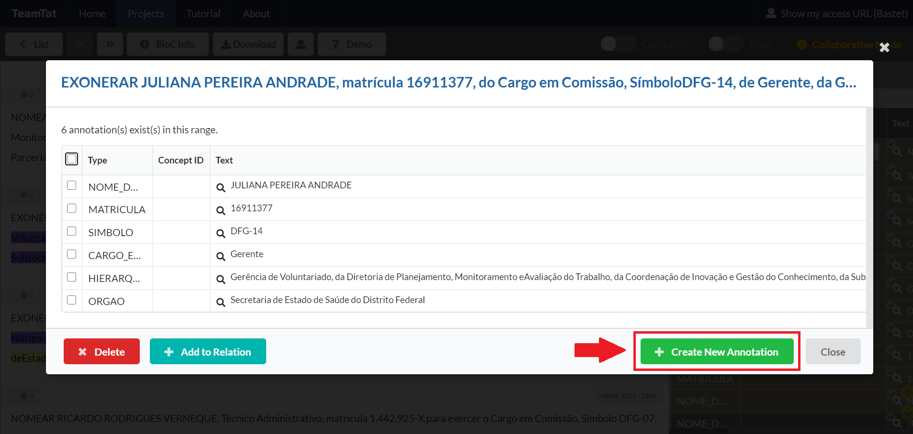

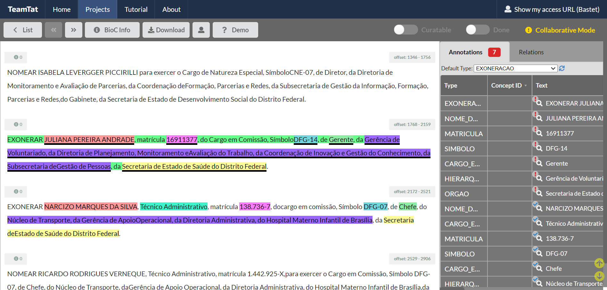

Quando os atos e as entidade estiverem anotados, é necessário criar as relações, lembrando que a relação é feita entra o ato e suas respectivas entidades, nunca entre atos. Para isso, selecione o texto que contém as entidades a serem relacionadas, assim que a janela pop-up aparecer, selecione as entidades e o ato que fará parte da relação e aperte em "Add to Relation".

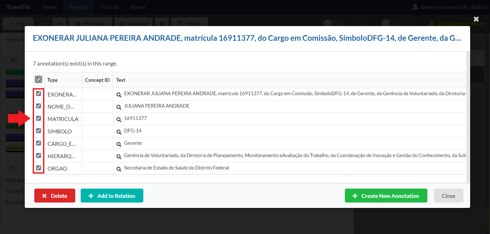

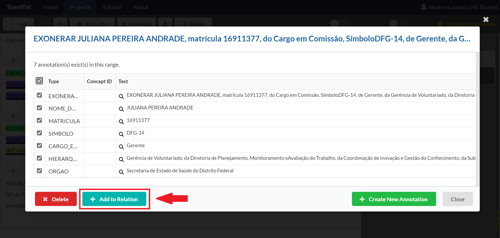

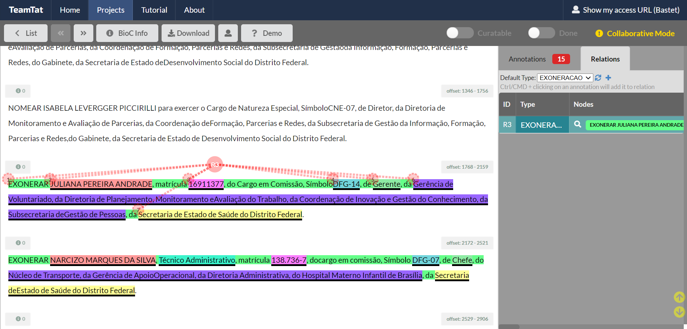

Por fim, quando todo o documento estiver pronto, clique em "DONE".

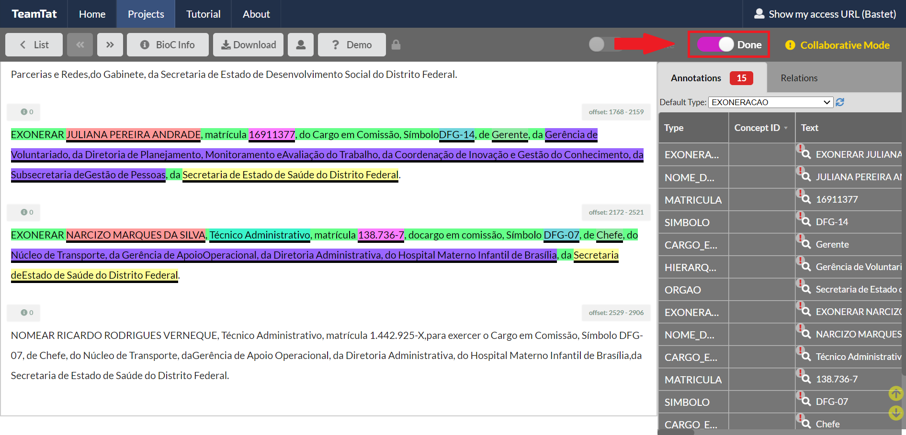

