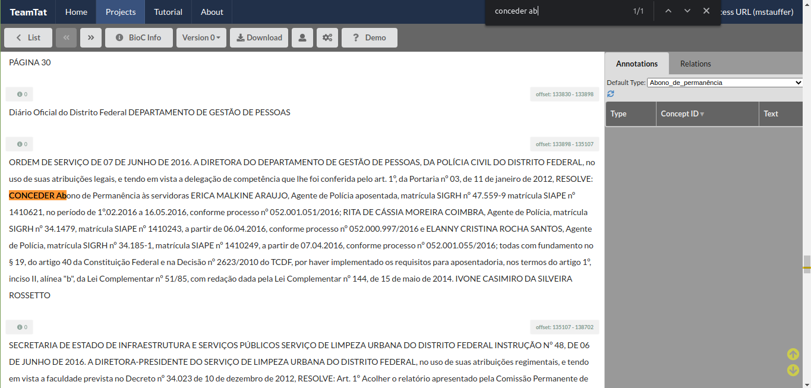
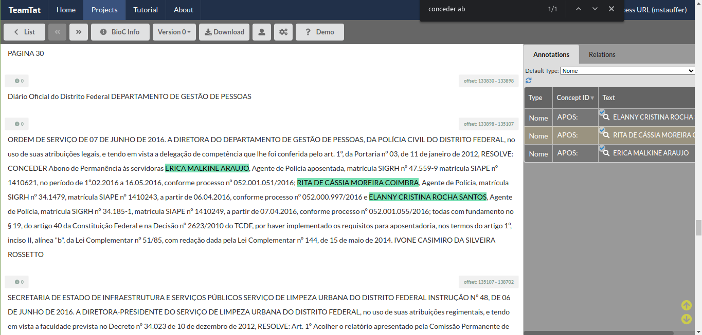
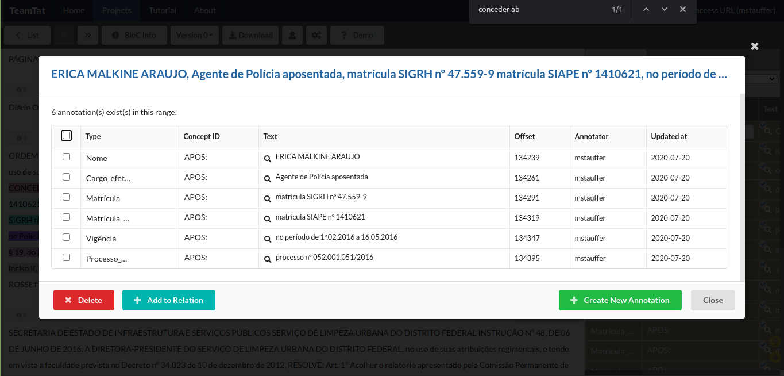
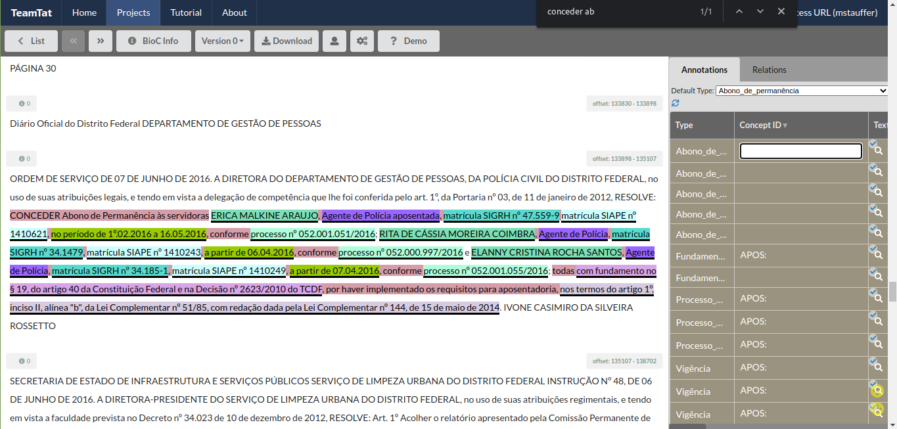
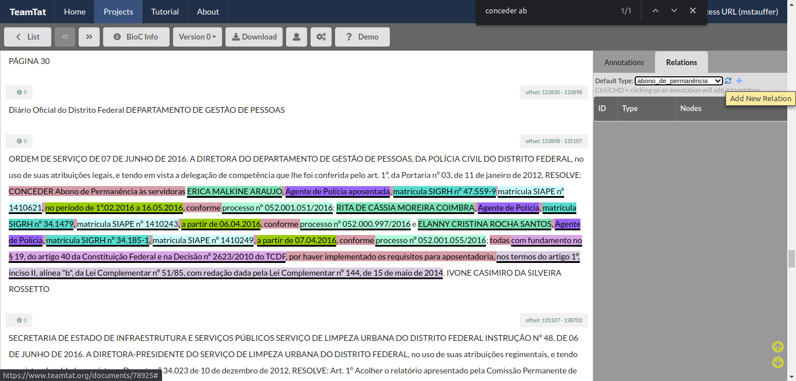
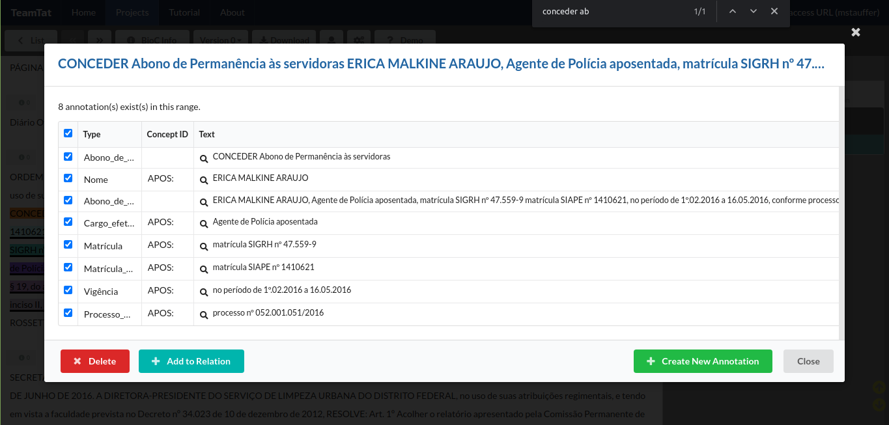
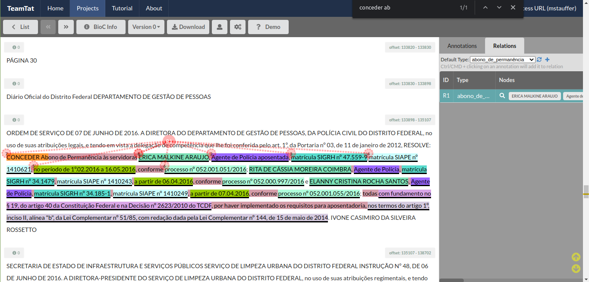
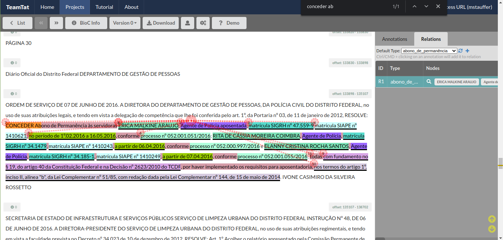
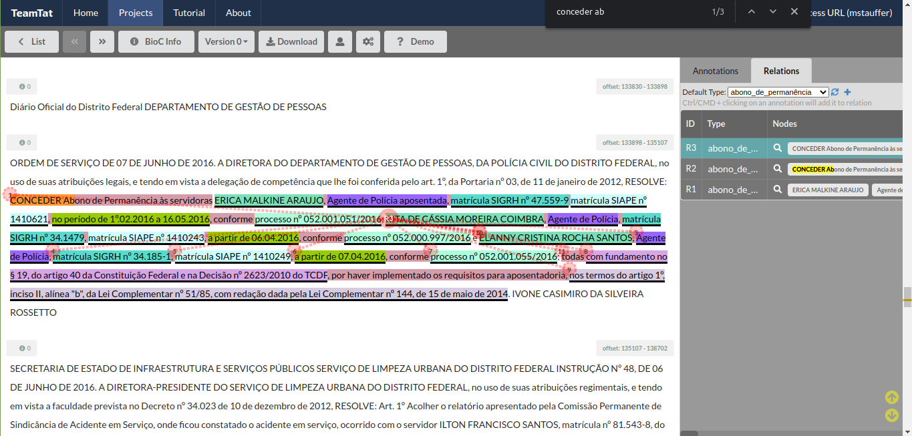

# Ato de Abono de Permanência

[//]: # (Paleta de cores usada nos destaques dos exemplos obtida em http://tsitsul.in/blog/coloropt/)

[//]: # (Atributos extras encontrados durante a elaboração desse doc: CARREIRA e ETAPA)

Abono de permanência é um valor reembolsado ao servidor público que já completou as exigências para aposentadoria voluntária mas optou por permanecer em atividade até que complete as exigências da aposentadoria compulsória. Foi instituído primeiramente pela <a href="http://www.planalto.gov.br/ccivil_03/constituicao/emendas/emc/emc41.htm">Emenda Constitucional nº 41, de 16 de dezembro de 2003</a>, que teve sua redação alterada após a reforma da previdência, com o novo texto vigente constante na <a href="http://www.planalto.gov.br/ccivil_03/constituicao/emendas/emc/emc103.htm">Emenda Constitucional nº 103 de 2019</a>.

_Refs:_
1. <a href="https://pt.wikipedia.org/wiki/Abono_de_perman%C3%AAncia">https://pt.wikipedia.org/wiki/Abono_de_perman%C3%AAncia</a>
2. <a href="https://jus.com.br/artigos/82775/abono-de-permanencia-o-que-mudou-com-a-reforma-da-previdencia">https://jus.com.br/artigos/82775/abono-de-permanencia-o-que-mudou-com-a-reforma-da-previdencia</a>

### Tabela de entidades e padrões
Em geral, os atos de abono de permanência seguem os seguintes padrões.

ID | Rótulo | Entidade (descrição)  | Padrão  
------- | ------- | ------- | -------
(1) | nome | Nome do Servidor | Letras maiúsculas
(2) | matricula| Matrícula | Após 'matrícula n°'
(3) | cargo_efetivo | Cargo Efetivo | Sem Padrão
(4) | classe | Classe | Após cargo
(5) | padrao | Padrão | Após classe
(6) | quadro | Quadro pessoal permanente ou Suplementar | Após padrão, começa com 'do Quadro'
(7) | fundamento_legal_abono_permanencia | Fundamento Legal do abono de permanência | Após 'com fundamento no' ou 'com base no'
(8) | fundamento_legal_aposentadoria | Fundamento Legal da aposentadoria | Começa com 'nos termos do'
(9) | orgao | Órgão | Sem Padrão
(10)| processo_SEI | Processo GDF/SEI | Começa com 'Processo SEI' ou 'Processo'
(11)| vigencia | Vigência | Após 'a contar de' ou 'a partir de' ou 'no período de'
(12)| matricula_SIAPE | Matricula SIAPE | SIAPE 

### Exemplos de atos de abono de permanência:

Seguem exemplos de atos de abono de permanência. O texto do ato em si estará sublinhado e seus respectivos atributos ***destacados*** enumerados conforme índice da tabela acima. Note que nem todos os exemplos contemplam todos os atributos. **A regra aqui é simples: marque todos os atributos, obrigatórios ou não, que estiverem no ato.**

> O SECRETÁRIO DE ESTADO DE DESENVOLVIMENTO URBANO E MEIO AMBIENTE DO DISTRITO FEDERAL, no uso das atribuições que lhe confere o inciso V do Parágrafo Único do artigo 105 da Lei Orgânica do Distrito Federal e considerando o que dispõe o inciso IX, do artigo 4°, do Decreto n° 27.591, de 1° de janeiro de 2007, resolve:
<ins>CONCEDER Abono de Permanência nos termos do ***artigo 2º, § 5º, da Emenda Constitucional nº 41, de 19/12/2003, publicada no D.O.U. de 31/12/2003 (8)***, a servidora ***DEUSITA HELENA CORTES (1)***, matrícula ***32.054-4 (2)***, ***Técnico de Administração Pública (3)***, a contar de ***06/06/2008 (11)***, processo ***390.007.821/2008 (10)***, por ter completado os requisitos para aposentadoria e optado por permanecer em atividade.</ins>
_**Ref**: DODF 17/07/2008, Seção 2., Página 21._

> O DIRETOR DO DEPARTAMENTO DE ADMINISTRAÇÃO GERAL, DA POLÍCIA CIVIL DO DISTRITO FEDERAL, substituto, no uso de suas atribuições legais, tendo em vista o disposto na Ordem de Serviço/PCDF nº 82, de 25 de outubro de 2002, publicada no DODF nº 216, de 11 de novembro de 2002, RESOLVE:
<ins>CONCEDER Abono de Permanência a ***RAUL MASSAKAZU MATUDA (1)***, ***Perito Criminal (3)***, matrícula SIGRH ***27.143-8 (2)*** e matrícula SIAPE 1410121 (12)***, a partir de ***30.5.2011 (11)***, conforme processo ***052.001.145/2011 (10)***, ***com fundamento no artigo 40, § 19, da Constituição Federal, no artigo 1º, inciso I, da Lei Complementar nº 51/85 e na Decisão nº 2623/2010 do Tribunal de Contas do Distrito Federal (7)***.</ins>
_**Ref**: DODF 21/07/2011, Seção 2., Página 30._

> O DIRETOR DO DEPARTAMENTO DE GESTÃO DE PESSOAS, DA POLÍCIA CIVIL DO DISTRITO FEDERAL, em exercício, no uso de suas atribuições legais, e tendo em vista a delegação de competência que lhe foi conferida pelo artigo 1º da Portaria nº 03, de 11 de janeiro de 2012, RESOLVE:
<ins>CONCEDER abono de permanência a ***DEUSMAR APARECIDO DE CARVALHO (1)***, ***Escrivão de Polícia (3)***, matrícula SIGRH nº ***35.167-9 (2)***, matrícula SIAPE nº ***1409304 (12)***, a partir de ***12.07.2013 (11)***, conforme processo ***052.001.128/2013 (10)***, ***com fundamento no § 19, do artigo 40 da Constituição Federal e na Decisão nº 2623/2010 do TCDF, por haver implementado tempo de contribuição para aposentação, nos termos do artigo 1º, inciso I, da Lei Complementar nº 51/85 (7)***.</ins>
_**Ref**: DODF 17/07/2013, Seção 2., Página 46._

> A DIRETORA DO DEPARTAMENTO DE GESTÃO DE PESSOAS, DA POLÍCIA CIVIL DO DISTRITO FEDERAL, no uso de suas atribuições legais, e tendo em vista a delegação de competência que lhe foi conferida pelo art. 1º, da Portaria nº 03, de 11 de janeiro de 2012, RESOLVE:
CONCEDER Abono de Permanência às servidoras ***ERICA MALKINE ARAUJO (1)***, ***Agente de Polícia aposentada (3)***, matrícula SIGRH nº ***47.559-9 (2)*** matrícula SIAPE nº ***1410621 (12)***, no período de ***1º.02.2016 a 16.05.2016 (11)*** conforme processo nº ***052.001.051/2016 (10)***; ***RITA DE CÁSSIA MOREIRA COIMBRA (1)***, ***Agente de Polícia (3)***, matrícula SIGRH nº ***34.147-9 (2)***, matrícula SIAPE nº ***1410243 (12)***, a partir de ***06.04.2016 (11)***, conforme processo nº ***052.000.997/2016 (10)*** e ***ELANNY CRISTINA ROCHA SANTOS (1)***, ***Agente de Polícia (3)***, matrícula SIGRH nº ***34.185-1 (2)***, matrícula SIAPE nº ***1410249 (12)***, a partir de ***07.04.2016 (11)***, conforme processo nº ***052.001.055/2016 (10)***; todas ***com fundamento no § 19, do artigo 40 da Constituição Federal e na Decisão nº 2623/2010 do TCDF (7)***, por haver implementado os requisitos para aposentadoria, nos termos do ***artigo 1º, inciso II, alínea "b", da Lei Complementar nº 51/85, com redação dada pela Lei Complementar nº 144, de 15 de maio de 2014 (8)***.
_**Ref**: DODF 10/06/2016, Seção 2., Página 30._
**Importante:** Note que esse caso acima é um desafio para a anotação: três atos constam em um mesmo parágrafo - por isso o texto não está sublinhado -, compartilhando alguns atributos. Vamos usá-lo como exemplo para a sugestão de anotação.

### Sugestão de processo de anotação

1. Comece com uma busca global no documento pelos termos **"conceder ab"** ou **"abono d"**, usando Ctrl+F.

2. Marque os atributos. Selecione a entidade, conforme ilustra a imagem abaixo, e marque cada um dos atributos de um ato. Se preferir, também é possível anotar várias instâncias de um mesmo atributo - anotar primeiro todos os nomes, depois todas as matrículas, ...

3. Após ter todos os atributos de um ato anotados, anote o ato como um todo por meio da sua entidade identificadora. No caso, a entidade aqui é 'Abono de permanência'. Como a redação nesse exemplo foi feita de maneira que três atos distintos compartilham os atributos de Fundamento Legal da aposentadoria e Fundamento Legal do Abono, o que vamos fazer é anotar de maneira descontínua entidades de 'Abono de permanência' e depois unir esses nós com uma relação. As anotações da entidade 'Abono de permanência' aqui serão: 1. 'CONCEDER abono de permanência às servidoras'; 2. do NOME até o número do processo, para cada uma das três servidoras; 3. fundamento legal do abono e da aposentadoria. No final, teremos 5 instâncias da entidade 'Abono de permanência'. Como você vai anotar por cima de outras anotações, o programa pergunta se você deseja realmente fazer um overlap. Clique no botão verde 'Create New Annotation'.

O print abaixo mostra as 5 instâncias de 'abono de permanência' anotadas:

4. Adicione uma nova relação por meio da aba 'Relations'. É aqui que vamos garantir que os atributos anotados se refiram a um ato em específico. Clique no botão '+', Add New Relation. Quando você clicar nesse botão, é possível que o programa faça um scroll para início da página. Se isso acontecer, clique na seta para baixo do Ctrl+F - ou tecle 'Ctrl+F + Enter' novamente no teclado - e retorne para o ponto que você estava.

Se o texto do ato se referisse à apenas uma pessoa, bastaria selecionar o texto do ato por inteiro e adicionar uma relação contendo as entidades. No caso desse exemplo, vamos unir as marcações descontínuas da entidade 'abono de permanência' para criar relações individuais para cada ato específico. Como são três atos, criaremos três relações. Selecione todos as entidades marcadas e clique no botão azul 'Add to relation'.

O resultado da operação acima será o disposto abaixo:

Ainda não incluímos na relação os atributos de 'fundamento legal do abono' e 'fundamento legal da aposentadoria'. O procedimento para tanto é o mesmo anterior: basta selecionar o trecho faltante - que no caso é 'todas com fundamento...' até '...15 de maio de 2014' - e adicioná-lo à mesma relação. O resultado será o seguinte:

Agora precisamos fazer o mesmo para os dois atos restantes. No total, como aqui temos três atos de abono de permanência, então teremos três relações que identificam unicamente cada ato. O resultado final será assim:

### Observações Gerais sobre os Atos de Abono de Permanência:

* Nem sempre o ato terá todos os atributos, mas anote todos os que você encontrar.  
* Não anote vírgulas e pontos, a não ser que eles estejam dentro do atributo, como acontece em Hierarquia de Lotação.  
* Tenha muito cuidado para não apagar todoas a anotações de um documento, mesmo tendo função de anotador.
* É recomendado que, sempre que for fazer uma pausa mais prolongada, salve um arquivo xml com as suas anotações, por precaução. Desta forma, você terá um back up caso aconteça alguma coisa e você perca todas as anotações feitas no documento, e com isso não terá que começar a anotar do zero.

Pronto! Agora é só por uma boa playlist e seguir com o bom trabalho.
