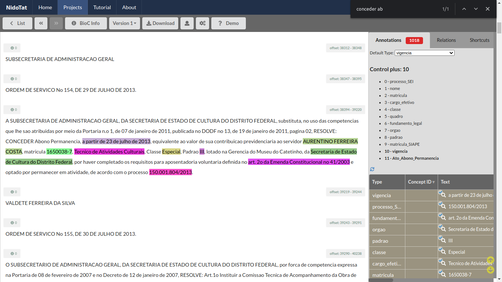

# Ato de Abono de Permanência

[//]: # (Paleta de cores usada nos destaques dos exemplos obtida em http://tsitsul.in/blog/coloropt/)

[//]: # (Atributos extras encontrados durante a elaboração desse doc: CARREIRA e ETAPA)

Abono de permanência é um valor reembolsado ao servidor público que já completou as exigências para aposentadoria voluntária mas optou por permanecer em atividade até que complete as exigências da aposentadoria compulsória. Foi instituído primeiramente pela <a href="http://www.planalto.gov.br/ccivil_03/constituicao/emendas/emc/emc41.htm">Emenda Constitucional nº 41, de 16 de dezembro de 2003</a>, que teve sua redação alterada após a reforma da previdência, com o novo texto vigente constante na <a href="http://www.planalto.gov.br/ccivil_03/constituicao/emendas/emc/emc103.htm">Emenda Constitucional nº 103 de 2019</a>.

_Refs:_
1. <a href="https://pt.wikipedia.org/wiki/Abono_de_perman%C3%AAncia">https://pt.wikipedia.org/wiki/Abono_de_perman%C3%AAncia</a>
2. <a href="https://jus.com.br/artigos/82775/abono-de-permanencia-o-que-mudou-com-a-reforma-da-previdencia">https://jus.com.br/artigos/82775/abono-de-permanencia-o-que-mudou-com-a-reforma-da-previdencia</a>

### Link tutorial em vídeo
- <a href="https://youtu.be/zY-yqAR_VO4" target="_blank">https://youtu.be/zY-yqAR_VO4</a>

### Tabela de entidades e padrões
Em geral, os atos de abono de permanência seguem os seguintes padrões.

ID | Rótulo | Entidade (descrição)  | Padrão  
------- | ------- | ------- | -------
(1) | nome | Nome do Servidor | Letras maiúsculas
(2) | matricula| Matrícula | Após 'matrícula n°'
(3) | cargo_efetivo | Cargo Efetivo | Sem Padrão
(4) | classe | Classe | Após cargo
(5) | padrao | Padrão | Após classe
(6) | quadro | Quadro pessoal permanente ou Suplementar | Após padrão, começa com 'do Quadro'
(7) | fundamento_legal | Fundamento Legal | Após 'com fundamento no' ou 'com base no' ou 'nos termos do'
(8) | orgao | Órgão | Sem Padrão
(9)| processo_SEI | Processo GDF/SEI | Começa com 'Processo SEI' ou 'Processo'
(10)| vigencia | Vigência | Após 'a contar de' ou 'a partir de' ou 'no período de'
(11)| matricula_SIAPE | Matricula SIAPE | SIAPE 

### Exemplos de atos de abono de permanência:

Seguem exemplos de atos de abono de permanência. O texto do ato em si estará sublinhado e suas respectivas entidades enumeradas conforme índice da tabela acima. Note que nem todos os exemplos contemplam todas as entidades. **A regra aqui é simples: marque todas as entidades que estiverem no ato.**

> O SECRETÁRIO DE ESTADO DE DESENVOLVIMENTO URBANO E MEIO AMBIENTE DO DISTRITO FEDERAL, no uso das atribuições que lhe confere o inciso V do Parágrafo Único do artigo 105 da Lei Orgânica do Distrito Federal e considerando o que dispõe o inciso IX, do artigo 4°, do Decreto n° 27.591, de 1° de janeiro de 2007, resolve:
<ins>CONCEDER Abono de Permanência nos termos do ***artigo 2º, § 5º, da Emenda Constitucional nº 41, de 19/12/2003, publicada no D.O.U. de 31/12/2003 (7)***, a servidora ***DEUSITA HELENA CORTES (1)***, matrícula ***32.054-4 (2)***, ***Técnico de Administração Pública (3)***, a contar de ***06/06/2008 (10)***, processo ***390.007.821/2008 (9)***, por ter completado os requisitos para aposentadoria e optado por permanecer em atividade.</ins>
_**Ref**: DODF 17/07/2008, Seção 2, Página 21._

> O DIRETOR DO DEPARTAMENTO DE ADMINISTRAÇÃO GERAL, DA POLÍCIA CIVIL DO DISTRITO FEDERAL, substituto, no uso de suas atribuições legais, tendo em vista o disposto na Ordem de Serviço/PCDF nº 82, de 25 de outubro de 2002, publicada no DODF nº 216, de 11 de novembro de 2002, RESOLVE:
<ins>CONCEDER Abono de Permanência a ***RAUL MASSAKAZU MATUDA (1)***, ***Perito Criminal (3)***, matrícula SIGRH ***27.143-8 (2)*** e matrícula SIAPE 1410121 (11)***, a partir de ***30.5.2011 (10)***, conforme processo ***052.001.145/2011 (9)***, ***com fundamento no artigo 40, § 19, da Constituição Federal, no artigo 1º, inciso I, da Lei Complementar nº 51/85 e na Decisão nº 2623/2010 do Tribunal de Contas do Distrito Federal (7)***.</ins>
_**Ref**: DODF 21/07/2011, Seção 2, Página 30._

> O DIRETOR DO DEPARTAMENTO DE GESTÃO DE PESSOAS, DA POLÍCIA CIVIL DO DISTRITO FEDERAL, em exercício, no uso de suas atribuições legais, e tendo em vista a delegação de competência que lhe foi conferida pelo artigo 1º da Portaria nº 03, de 11 de janeiro de 2012, RESOLVE:
<ins>CONCEDER abono de permanência a ***DEUSMAR APARECIDO DE CARVALHO (1)***, ***Escrivão de Polícia (3)***, matrícula SIGRH nº ***35.167-9 (2)***, matrícula SIAPE nº ***1409304 (11)***, a partir de ***12.07.2013 (10)***, conforme processo ***052.001.128/2013 (9)***, ***com fundamento no § 19, do artigo 40 da Constituição Federal e na Decisão nº 2623/2010 do TCDF, por haver implementado tempo de contribuição para aposentação, nos termos do artigo 1º, inciso I, da Lei Complementar nº 51/85 (7)***.</ins>
_**Ref**: DODF 17/07/2013, Seção 2, Página 46._

> A DIRETORA DO DEPARTAMENTO DE GESTÃO DE PESSOAS, DA POLÍCIA CIVIL DO DISTRITO FEDERAL, no uso de suas atribuições legais, e tendo em vista a delegação de competência que lhe foi conferida pelo art. 1º, da Portaria nº 03, de 11 de janeiro de 2012, RESOLVE:
<ins>CONCEDER Abono de Permanência às servidoras ***ERICA MALKINE ARAUJO (1)***, ***Agente de Polícia aposentada (3)***, matrícula SIGRH nº ***47.559-9 (2)*** matrícula SIAPE nº ***1410621 (11)***, no período de ***1º.02.2016 a 16.05.2016 (10)*** conforme processo nº ***052.001.051/2016 (9)***; ***RITA DE CÁSSIA MOREIRA COIMBRA (1)***, ***Agente de Polícia (3)***, matrícula SIGRH nº ***34.147-9 (2)***, matrícula SIAPE nº ***1410243 (11)***, a partir de ***06.04.2016 (10)***, conforme processo nº ***052.000.997/2016 (9)*** e ***ELANNY CRISTINA ROCHA SANTOS (1)***, ***Agente de Polícia (3)***, matrícula SIGRH nº ***34.185-1 (2)***, matrícula SIAPE nº ***1410249 (11)***, a partir de ***07.04.2016 (10)***, conforme processo nº ***052.001.055/2016 (9)***; todas ***com fundamento no § 19, do artigo 40 da Constituição Federal e na Decisão nº 2623/2010 do TCDF, por haver implementado os requisitos para aposentadoria, nos termos do artigo 1º, inciso II, alínea "b", da Lei Complementar nº 51/85, com redação dada pela Lei Complementar nº 144, de 15 de maio de 2014 (7)***.</ins>
_**Ref**: DODF 10/06/2016, Seção 2., Página 30._
**Importante:** Note que nesse caso existem três servidoras contempladas no mesmo ato. É quase como se fossem três 'subatos', que compartilham alguns atributos. Se você se deparar com uma situação assim, sem pânico: apenas marque as entidades e o texto do ato inteiro normalmente, conforme ilustrado.

> A SUBSECRETARIA DE ADMINISTRACAO GERAL, DA SECRETARIA DE ESTADO DE CULTURA DO DISTRITO FEDERAL, substituta, no uso das competencias que lhe sao atribuidas por meio da Portaria n.o 1, de 07 de janeiro de 2011, publicada no DODF no 13, de 19 de janeiro de 2011, pagina 02, RESOLVE: <ins>CONCEDER Abono Permanencia, ***a partir de 23 de julho de 2013 (10)***, equivalente ao valor de sua contribuição previdenciária ao servidor ***AURENTINO FERREIRA COSTA (1)***, matricula ***1650038-7 (2)***, ***Tecnico de Atividades Culturais (3)***, Classe ***Especial (4)***, Padrao ***III (5)***, lotado na Gerencia do Museu do Catetinho, da ***Secretaria de Estado de Cultura do Distrito Federal (8)***, por haver completado os requisitos para aposentadoria voluntária definida no ***art. 2o da Emenda Constitucional no 41/2003 (7)*** e optado por permanecer em atividade, de acordo com o processo ***150.001.804/2013 (9)***.</ins>
_**Ref**: DODF 31/07/2013, Seção 2, Página 23._

### Sugestão de processo de anotação

1. Comece adicionando as entidades que você vai usar. Clique na aba chamada 'Filter', destacada em vermelho.

Em seguida, selecione as entidades do ato em questão e clique no botão 'Save'.

1. Agora vamos ao processo de anotação de fato. Comece com uma busca global no documento pelos termos **"conceder ab"** ou **"abono d"**, usando Ctrl+F.

2. Marque as entidades. O NidoTat permite que você selecione entidades usando o mouse (basta selecionar a entidade desejada e marcar o texto) ou usando os atalhos de teclado (selecione a entidade desejada, navegue pelo texto usando as teclas WASD, selecione um trecho do texto usando SHIFT e marque a entidade usando a barra de espaço).

3. Após ter todos os atributos de um ato anotados, anote o ato como um todo por meio da sua entidade identificadora. No caso, a entidade aqui é 'Ato_Abono_Permanencia'. Como você vai anotar por cima de outras anotações, o programa pergunta se você deseja realmente fazer um overlap. Clique no botão verde 'Create New Annotation'.

O print abaixo mostra o resultado final de anotação a nível de entidades:

4. Muito bem, agora só falta adicionar uma relação entre as entidades. Clique na aba 'Relations' e selecione a relação corresponde ao ato que você estiver anotando, no caso, 'Ato_Abono_Permanencia'.

5. Selecione o texto do ato de maneira que todas as entidades sejam incluídas e adicione a relação. O resultado final será o seguinte:

### Observações Gerais sobre os Atos de Abono de Permanência:

* Nem sempre o ato terá todos os atributos, mas anote todos os que você encontrar.  
* Não anote vírgulas e pontos, a não ser que eles estejam dentro do atributo, como acontece em Hierarquia de Lotação.  
* Tenha muito cuidado para não apagar todas as anotações de um documento, mesmo tendo função de anotador.

Pronto! Agora é só por uma boa playlist e seguir com o bom trabalho.
