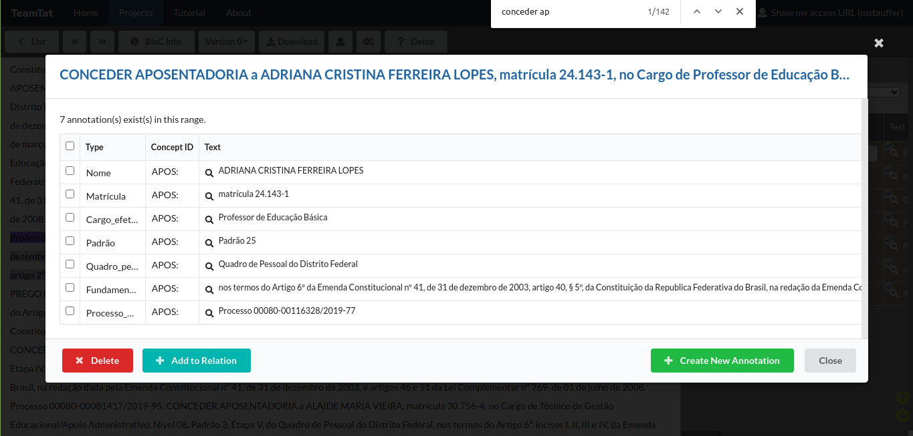

# Ato de Aposentadoria

[//]: # (Paleta de cores usada nos destaques dos exemplos obtida em http://tsitsul.in/blog/coloropt/)

[//]: # (Atributos extras encontrados durante a elaboração desse doc: CARREIRA e ETAPA)

O termo Aposentadoria se refere ao afastamento remunerado de um trabalhador após o cumprimento de uma série de requisitos legais estabelecidos por cada país. O trabalhador aposentado faz uso de um plano de previdência público e/ou privado.
_Refs:_
1. <a href="https://pt.wikipedia.org/wiki/Aposentadoria">https://pt.wikipedia.org/wiki/Aposentadoria</a>
2. <a href="https://pt.wikipedia.org/wiki/Aposentadoria_no_Brasil">https://pt.wikipedia.org/wiki/Aposentadoria_no_Brasil</a>

### Tabela de atributos e padrões
Em geral, os atos de aposentadoria seguem os seguintes padrões.

| Atributos     | Obrigatoriedade | Padrão        |
| ------------- |:-------------:| --------------- |
| Tipo da aposentadoria (1)     | Não obrigatório | Após 'CONCEDER' ou 'APOSENTAR' |
| Nome do Servidor (2)    | Obrigatório | Letras maiúsculas |
| Matrícula (3) | Obrigatório | Após 'matrícula n°' |
| Cargo Efetivo (4) | Obrigatório | Sem Padrão |
| Classe (5) | Não obrigatório | Após cargo |
| Padrão (6) | Não obrigatório | Após classe |
| Quadro pessoal permanente ou Suplementar (7) | Obrigatório | Após padrão, começa com 'do Quadro' |
| Fundamento Legal (8) | Obrigatório | Começa com 'nos termos do' |
| Órgão (9) | Obrigatório | Sem Padrão |
| Processo GDF/SEI (10) | Obrigatório | Começa com 'Processo SEI' ou 'Processo' |
| Vigência (11) | Não obrigatório | Após 'a contar de' |
| Matricula SIAPE (12) | Não obrigatório | SIAPE |

### Exemplos de atos de aposentadoria:
Seguem exemplos de atos de aposentadoria. O texto do ato em si estará sublinhado e seus respectivos atributos ***destacados*** e enumerados conforme índice da tabela acima. Note que nem todos os exemplos contemplam todos os atributos. **A regra aqui é simples: marque todos os atributos, obrigatórios ou não, que estiverem no ato.**

> O SECRETÁRIO DE ESTADO DE CULTURA DO DISTRITO FEDERAL, no uso das atribuições que lhe são conferidas pelo Decreto n.º 23.212, de 06 de setembro de 2002, resolve:
<ins>Conceder aposentadoria a servidora: ***IRACY VIEIRA DA SILVA (2)***, Matrícula: ***1650336-5 (3)***, Cargo: ***AUXILIAR DE ATIVIDADES CULTURAIS (4)***, Classe: ***1ª (5)***, Padrão: ***IV (6)***, ***Quadro: Suplementar do GDF (7)***, Processo: ***0150-001684/ 2003 (10)***, ***Artigo 40, § 1º, inciso III, alínea “b” e § 8º, da CONSTITUIÇÃO DA REPÚBLICA FEDERATIVA DO BRASIL (8)***.</ins>
_**Ref**: DODF 10/07/ 2003, Seção 2., Página 17._

> O SECRETÁRIO DE ESTADO DE CULTURA DO DISTRITO FEDERAL, no uso das atribuições que lhe são conferidas pelo Decreto n° 23.212, de 06 de setembro de 2002, resolve:
<ins>CONCEDER aposentadoria a ***ADOLFINA DE MENEZES (2)***, matrícula ***650214-8 (3)***, CARGO ***Técnico de Atividades Culturais (4)***, Classe: ***1ª (5)***, Padrão: ***IV (6)***, ***Quadro Permanente do GDF (7)***, ***artigo 3º, inciso I e II, Parágrafo Único, da Emenda Constitucional n° 47, de 05 de julho de 2005, publicada no Diário Oficial da União de 06 de julho de 2005 (8)***. Processo ***150.001.544/2006 (10)***.</ins>
_**Ref**: DODF 10/07 /2006, Seção 2, Página 48._

> O CHEFE DA UNIDADE DE ADMINISTRAÇÃO GERAL DA SECRETARIA DE ESTADO DE DESENVOLVIMENTO SOCIAL E TRANSFERÊNCIA DE RENDA DO DISTRITO FEDERAL, no uso das atribuições que lhe confere a Portaria nº50, de 15 de abril de 2008, publicado no DODF nº 72, de 16 de abril de 2008, resolve:
<ins>APOSENTAR, nos termos do ***artigo 40, § 1º, Inciso I, e § 3º, da Constituição da República Federativa do Brasil, com redação dada pela Emenda Constitucional nº 20, de 15 de dezembro de 1998, combinado com os artigos 3º e 7º, da Emenda Constitucional nº. 41, de 19 de dezembro de 2003, e os artigos 186, inciso I, § 1º, e 189, da Lei nº. 8.112, de 11 de dezembro de 1990, combinado com os artigos 18 e 46 da Lei Complementar nº. 769 de 30 de junho de 2008 (8)***, a ***ANTONIO TELES CARDOSO DE ALBUQUERQUE (2)***, matrícula ***102.289-X (3)***, ***Assistente Básico em Serviços Sociais (4)***, ***Classe Especial (5)***, Padrão ***V (6)***, do ***Quadro de Pessoal da Secretaria de Estado de Desenvolvimento Social e Transferência de Renda do Distrito Federal (7)***. Processo ***410.001453/2009 (10)***.</ins>
_**Ref**: DODF 10/07/ 2009, Seção 2, Página 27._

> <ins>A PRESIDENTE DO TRIBUNAL DE CONTAS DO DISTRITO FEDERAL, no uso da atribuição que lhe confere o art. 68, inc. III, da Lei Complementar nº 1, de 9 de maio de 1994, e tendo em vista o que se apresenta no Processo nº ***20211/2010 (10)***, RESOLVE:
CONCEDER ***aposentadoria voluntária (1)*** ao servidor ***REIJANE LAÉRCIO CAVALCANTE DE OLIVEIRA (2)***, matrícula ***nº 940-7 (3)***, no cargo de ***Analista de Administração Pública (4)***, ***Classe Especial (5)***, Padrão ***63 (6)***, do ***Quadro de Pessoal dos Serviços Auxiliares deste Tribunal (7)***, fundamentada no ***art. 3º, parágrafo único, da Emenda Constitucional nº 47/05, c/c a Lei Complementar nº 769/08, com a vantagem pessoal prevista no art. 1º da Lei nº 1.004/96 e no art. 4º da Lei nº 1.141/96, mantida pelo parágrafo único do art. 4º da Lei nº 1.864/98 (8)***.</ins>
_**Ref**: DODF 11/07 /2011, Seção 2, Página 39_.

> O PROCURADOR-GERAL DO DISTRITO FEDERAL, no exercício das atribuições que lhe conferem o artigo 6º, inciso XXXV, da Lei Complementar nº 395, de 31 de julho de 2001, e o artigo 1º, inciso I, alínea ‘a’ do Decreto nº 23.212, de 6 de setembro de 2002, RESOLVE:
<ins>APOSENTAR ***CARLOS AUGUSTO FIGUEIREDO SALAZAR (2)***, matrícula ***39.228-6 (3)***, no cargo de ***Subprocurador-Geral do Distrito Federal, da Carreira de Procurador do Distrito Federal (4)***, nos termos do ***artigo 40, § 1º, inciso II, da Constituição da República Federativa do Brasil, com a redação dada pela Emenda Constitucional nº 20, de 15 de dezembro de 1998, combinado com o artigo 19 da Lei Complementar nº 769, de 30 de junho de 2008, conforme decisão nº 4.906/2010, item I, alínea ‘a’, do Tribunal de Contas do Distrito Federal (8)***.
Processo nº ***0020-003.855/2013 (10)***.</ins>
_**Ref**: DODF 10/07 /2013, Seção 2, Página 33_.

> O DIRETOR DA ADMINISTRAÇÃO DE PROFISSIONAIS E ACOMPANHAMENTO DO CADASTRO E DA FOLHA DE PAGAMENTO DA SUBSECRETARIA DE GESTÃO DO TRABALHO E DA EDUCAÇÃO EM SAÚDE DA SECRETARIA DE ESTADO DE SAÚDE DO DISTRITO FEDERAL, no uso das atribuições regimentais e considerando o disposto no artigo 3º, item VII, alínea “i”, itens XII e XIII da Portaria nº 61, de 30 de março de 2009, publicada no DODF nº 63, de 01/04/2009, RESOLVE:
<ins>CONCEDER APOSENTADORIA, nos termos do ***artigo 3º, incisos I, II, III, parágrafo único da Emenda Constitucional nº 47/2005, combinados com o artigo 41, § 7º da Lei Orgânica do Distrito Federal, combinados com artigo 44 da Lei Complementar nº 769, de 30/06/2008 (8)*** a ***VICENTE DE PAULA BRITO (2)***, matrícula n° ***123.773-X (3)***, na Carreira de Assistência Pública à Saúde no Cargo de ***Técnico em Saúde –Motorista (4)***, ***Classe Especial (5)***, Padrão ***V (6)***, do ***Quadro de Pessoal da Secretaria de Estado de Saúde do Distrito Federal (7)***. Lotação: ***HRG (9)***. Processo nº ***275.000.335/2015 (10)***.</ins>
_**Ref**: DODF 10/07/2015, Seção 2, Página 27_.

> O SUBSECRETÁRIO DE ADMINISTRAÇÃO GERAL, DA SECRETARIA DE ESTADO DE FAZENDA DO DISTRITO FEDERAL, no uso das atribuições que lhe são conferidas pelo artigo 2º, inciso I, da Portaria/SEF nº 734, de 03 de dezembro de 2003, publicada no DODF nº 235, de 04 de dezembro de 2003, RESOLVE:
<ins>CONCEDER aposentadoria ao servidor ***GENIVALDO DA SILVA BARBOSA (2)***, matrícula nº ***25.246-8 (3)***, ***Auditor-Fiscal da Receita do Distrito Federal (4)***, ***Classe Especial (5)***, Padrão ***V (6)***, do ***Quadro de Pessoal do Distrito Federal (7)***, nos termos do ***artigo 3º, incisos I, II e III, e Parágrafo Único, da Emenda Constitucional nº 47, de 05 de julho de 2005, combinado com o artigo 44, incisos I, II e III, da Lei Complementar nº 769, de 30 de junho de 2008, e com a vantagem prevista no artigo 5º, da Lei nº 4.584, de 08 de julho de 2011 (8)***. Processo SEI nº ***0040-00054226/2017-38 (10)***.</ins>
_**Ref**: DODF 10/07/2017, edição Íntegra, Página 10_.

> A DIRETORA DE PREVIDÊNCIA, DO INSTITUTO DE PREVIDÊNCIA DOS SERVIDORES DO DISTRITO FEDERAL, no uso das atribuições conferidas pelo artigo 1º do Decreto nº 38.649, de 27 de novembro de 2017, e pela Portaria n.º 33, de 25 de fevereiro de 2019, resolve:
<ins>APOSENTAR, ***WELTON BEZERRA DA SILVA (2)***, matrícula n.º ***35.096-6 (3)***, no cargo de ***Analista em Políticas Públicas e Gestão Governamental (4)***, ***Classe Especial (5)***, Padrão ***V (6)***, do ***Quadro de Pessoal do Distrito Federal (7)***, nos termos do ***artigo 40, § 1º, inciso I, da Constituição da República Federativa do Brasil, na redação dada pela Emenda Constitucional n.º 41, de 19/12/2003, combinado com o artigo 6º-A da Emenda Constitucional nº 41, de 19/12/2003, incluído pela Emenda Constitucional nº 70, de 29/03/2012, ficando a beneficiária por este ato alertado que o exercício de qualquer atividade remunerada importará na cessação do benefício, nos termos do artigo 18, § 8º da Lei Complementar nº 769, de 30/06/2008 (8)***. Lotação: ***Secretaria de Estado de Fazenda, Planejamento, Orçamento e Gestão do Distrito Federal (9)***. Processo SEI n.º ***00040-00013911/2019-76 (10)***.</ins>
_**Ref**: DODF 10/07/2019, edição Íntegra, Página 24_.

> O DIRETOR DE ADMINISTRAÇÃO DE PROFISSIONAIS, DA COORDENAÇÃO DE ADMINISTRAÇÃO DE PROFISSIONAIS, DA SUBSECRETARIA DE GESTÃO DE PESSOAS, DA SECRETARIA DE ESTADO DE SAÚDE DO DISTRITO FEDERAL, no uso das atribuições que lhe confere o Regimento Interno da Secretaria de Estado de Saúde do Distrito Federal, aprovado pelo Decreto nº 39.546/2018, e das que lhe foram delegadas por meio dos artigos 9 e 10, da Portaria nº 708/2018, resolve:
<ins>CONCEDER APOSENTADORIA, nos termos do ***artigo 3º, incisos I, II, III, parágrafo único da Emenda Constitucional nº 47/2005, combinados com artigo 44 da Lei Complementar nº 769, de 30/06/2008 (8)***, a ***EDNACY MOURA ALVES SEIXAS (2)***, matrícula n° ***130.132-2 (3)***, na Carreira de Assistência Pública à Saúde, no Cargo de ***Técnico em Saúde – AUXILIAR DE ENFERMAGEM (4)***, ***Classe Especial (5)***, Padrão ***V (6)***, do ***Quadro de Pessoal da Secretaria de Estado de Saúde do Distrito Federal (7)***. Lotação: ***SRSSU (9)***. Processo: ***00060-00151990/2020-81 (10)***.</ins>
_**Ref**: DODF 10/07/2020, edição Íntegra, Página 22_.

> O DIRETOR DO DEPARTAMENTO DE GESTÃO DE PESSOAS, DA POLÍCIA CIVIL DO DISTRITO FEDERAL, Em exercício, no uso de suas atribuições legais e tendo em vista a delegação de competência que lhe foi conferida pelo artigo 1º, inciso IV, da Portaria 25, de 18 de junho de 2.018, resolve: <ins>CONCEDER aposentadoria a ***CLÁUDIA HELENA MONTEIRO MENDES DE SOUZA (2)***, matrícula nº ***47.196-8 (3)***, no cargo efetivo de ***Agente de Polícia (4)***, ***Classe Especial (5)***, da Carreira de Polícia Civil do Distrito Federal, nos termos ***artigos 5º, § 3º, 20, §§ 2º, inciso I, e 3º, inciso I, da Emenda Constitucional nº 103/2019, c/c o artigo 1º, inciso II, alínea "b", da Lei Complementar nº 51/85 (8)***. rocesso SEI nº ***00052-00011239/2020-24 (10)***.</ins>
_**Ref**: DODF 17/07/2020, edição íntegra, Página 39_.

### Sugestão de processo de anotação

1. Comece com uma busca global no documento pelos termos **"conceder ap"** ou **aposentar**, usando Ctrl+F. O resultado será algo assim:

2. Marque os atributos. Selecione a entidade, conforme ilustra a imagem abaixo, e marque cada um dos atributos de um ato. Se preferir, também é possível anotar várias instâncias de um mesmo atributo - anotar primeiro todos os nomes, depois todas as matrículas, ...

3. Após ter todos os atributos de um ato anotados, anote o ato como um todo por meio da sua entidade identificadora. No caso, a entidade aqui é 'Aposentadoria'. Como você vai anotar por cima de outras anotações, o programa pergunta se você deseja realmente fazer um overlap. Clique no botão verde 'Create New Annotation'.

4. Adicione uma nova relação por meio da aba 'Relations'. É aqui que vamos garantir que os atributos anotados se refiram a um ato em específico. Clique no botão '+', Add New Relation. Quando você clicar nesse botão, é possível que o programa faça um scroll para início da página. Se isso acontecer, clique na seta para baixo do Ctrl+F - ou aperte Ctrl+F + Enter no teclado - e retorne para o ponto que você estava.

Selecione o texto do ato por inteiro novamente. Selecione todos as entidades marcadas e clique no botão azul 'Add to relation'.

### Observações Gerais sobre os Atos de Aposentadoria:

* Nem sempre o ato terá todos os atributos, mas anote todos os que você encontrar.  
* Não anote vírgulas e pontos, a não ser que eles estejam dentro do atributo, como acontece em Hierarquia de Lotação.  
* Tenha muito cuidado para não apagar todoas a anotações de um documento, mesmo tendo função de anotador.
* É recomendado que, sempre que for fazer uma pausa mais prolongada, salve um arquivo xml com as suas anotações, por precaução. Desta forma, você terá um back up caso aconteça alguma coisa e você perca todas as anotações feitas no documento, e com isso não terá que começar a anotar do zero.

Pronto! Agora é só por uma boa playlist e seguir com o bom trabalho.
