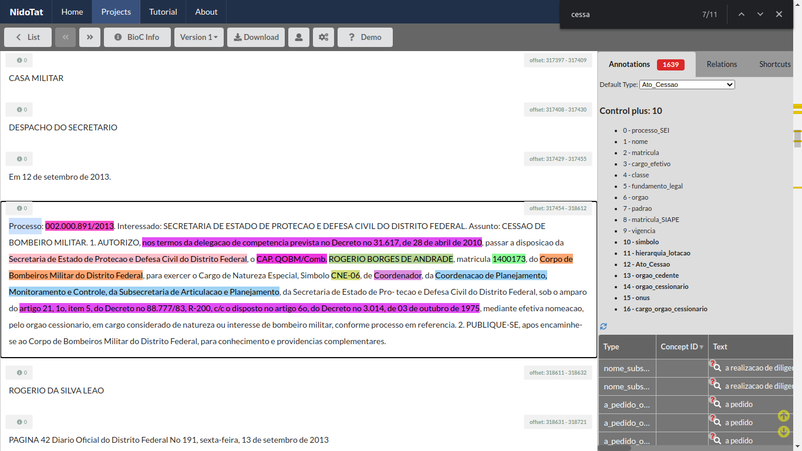
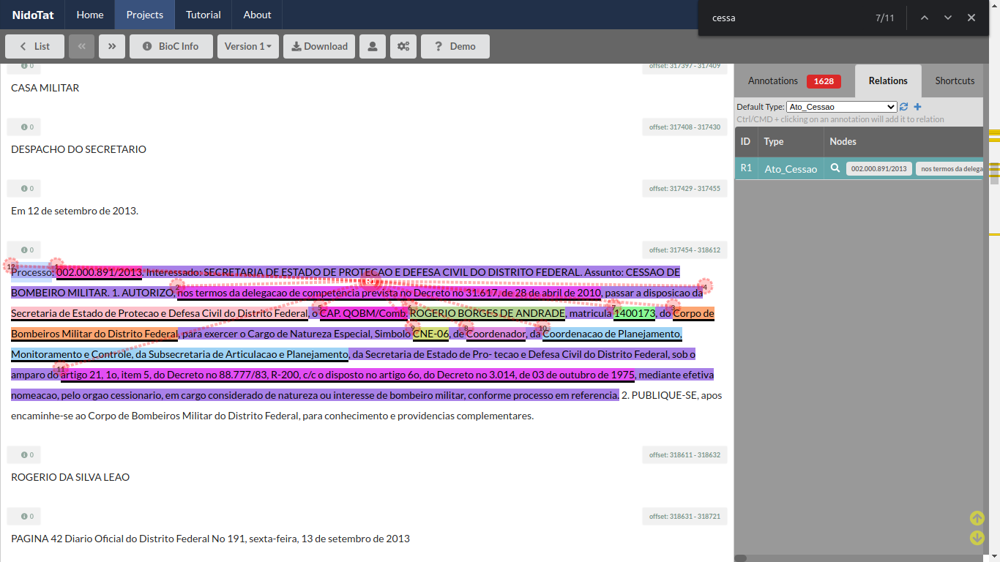

# Ato de Cessão

[//]: # (Paleta de cores usada nos destaques dos exemplos obtida em http://tsitsul.in/blog/coloropt/)

[//]: # (Atributos extras encontrados durante a elaboração desse doc: CARREIRA e ETAPA)

A cessão consiste no “afastamento temporário de servidor público, titular de cargo efetivo ou emprego público, que lhe possibilita exercer atividades em outro órgão ou entidade, da mesma esfera de governo ou de esfera distinta, para ocupar cargo em comissão, função de confiança ou ainda para atender às situações estabelecidas em lei, com o propósito de cooperação entre as Administrações” (PAZ, Caroline Lima; PICININ, Cláudia Carvalho. Cessão de servidor público: uma análise com enfoque nas decisões proferidas pelo TCE/MG e pelo TJMG. Revista TCE/MG, jan-mar 2014).

_Refs:_
1. <a href="https://jus.com.br/artigos/67519/a-irregularidade-na-cessao-de-servidor-publico-por-prazo-indeterminado">https://jus.com.br/artigos/67519/a-irregularidade-na-cessao-de-servidor-publico-por-prazo-indeterminado</a>
2. <a href="https://revista1.tce.mg.gov.br/Content/Upload/Materia/2521.pdf">https://revista1.tce.mg.gov.br/Content/Upload/Materia/2521.pdf</a>

### Link tutorial em vídeo
- <a href="https://youtu.be/rekuJTcNa-0" target="_blank">https://youtu.be/rekuJTcNa-0</a>

### Tabela de entidades e padrões
Em geral, os atos de abono de permanência seguem os seguintes padrões.

ID | Rótulo | Entidade (descrição)  | Padrão  
------- | ------- | ------- | -------
(1) | nome | Nome do Servidor | Letras maiúsculas
(2) | matricula | Matrícula | Após 'matrícula n°'
(3) | cargo_efetivo | Cargo Efetivo | Sem Padrão
(4) | classe | Classe | Após cargo
(5) | padrao | Padrão | Após classe
(6) | orgao_cedente | Órgão Cedente | Sem padrão
(7) | orgao_cessionario | Órgão Cessionário | Sem padrão
(8) | onus | Ônus | Após 'com ônus para'
(9) | fundamento_legal | Fundamento Legal | Começa com 'nos termos do' ou 'com base'
(10)| processo_SEI | Processo GDF/SEI | Começa com 'Processo SEI' ou 'Processo'
(11)| vigencia | Vigência | Após 'a contar de' ou 'a partir de' ou 'no período de'
(12)| matricula_SIAPE | Matricula SIAPE | Após SIAPE
(13)| cargo_orgao_cessionario | Cargo que exercerá no órgão cessionário | Sem padrão
(14)| simbolo | Símbolo do cargo que exercerá no órgão cessionário | Sem padrão
(15)| hierarquia_lotacao | Hierarquia da Lotação no órgão cessionário | Sem padrão

#### Exemplos de atos de cessão:
Seguem exemplos de atos de cessão. O texto do ato em si estará sublinhado e suas respectivas entidades enumeradas conforme índice da tabela acima. Note que nem todos os exemplos contemplam todas as entidades. **A regra aqui é simples: marque todas as entidades que estiverem no ato.**

> <ins> *Processo: 00370-00002649/2018-11 (10)*. Interessado: CHARLISSON NOGUEIRA SILVA. Assunto: CESSÃO DE SERVIDOR.
AUTORIZO,  *com base nos arts. 19 e 20, do Decreto nº 39.009, de 26/4/2018 e na forma do art. 152, inciso I, alínea "a" com o art. 154, parágrafo único, inciso II, da Lei Complementar nº 840, de 23/12/2011 (9)*, a cessão do servidor *CHARLISSON NOGUEIRA SILVA (1)*,  *matrícula nº 127.100-8 (2)*,  *Analista em Políticas Públicas e Gestão Governamental (3)*, da *Secretaria de Estado de Planejamento, Orçamento e Gestão do Distrito Federal - SEPLAG/DF (6)*, para exercer o Cargo de Natureza Especial, *símbolo CNE-07 (14)*, de *Diretor da Diretoria de Planejamento, Orçamento e Finanças (13)*, da Secretaria de Estado de Economia, Desenvolvimento, Inovação, Ciência e Tecnologia do Distrito Federal, *com ônus para o órgão de origem (8)*. Em conformidade com o art. 153, incisos I e II, parágrafo único, da Lei Complementar n 840, de 23/12/2011, *a cessão termina com a exoneração do cargo para a qual o servidor foi cedido ou com a revogação pela autoridade cedente (11)*.</ins>
Publique-se e encaminhe-se à Secretaria de Estado de Planejamento, Orçamento e Gestão do Distrito Federal - SEPLAG/DF, para as providências pertinentes.
_**Ref**: DODF 10/07/2018, Edição íntegra, Página 38._

> <ins>  *PROCESSO Nº: 010.000.059/2006 (10)*; INTERESSADO: *SECRETARIA DE ESTADO DE SEGURANÇA PÚBLICA E DEFESA SOCIAL DO DISTRITO FEDERAL (7)*; ASSUNTO: CESSÃO DE POLICIAIS MILITARES.
1\. AUTORIZO passar à disposição da Secretaria de Estado de Segurança Pública e Defesa Social do Distrito Federal – SSPDS/DF, o  *1º Sargento QPPMC (3)* *PATRÍCIO JOSÉ DE MEDEIROS (1)*,  *Matrícula 07.983-9 (2)* e o  *2º Sargento QPPMC (3)* *DELTON DE OLIVEIRA PINHEIRO (1)*,  *Matrícula 07.907-3 (2)*, para exercerem o Cargo em Comissão, *Símbolo DFA-03 (14)*, de *Despachante da Central Integrada de Atendimento e Despacho (13)* do *Centro Integrado de Operações de Segurança Pública e Defesa Social, daquela Secretaria (15)*, bem como os  *Soldados QPPMC (3)* *JOÃO PAULO SANTANA SOBRINHO (1)*,  *Matrícula 14.185-2 (2)* e *FRANCISCO NASCIMENTO LIMA (1)*,  *Matrícula 22.328-X (2)*, para exercerem o Cargo em Comissão, *Símbolo DFA-01 (14)*, de *Atendente da Central Integrada de Atendimento e Despacho (13)* do *Centro Integrado de Operações de Segurança Pública e Defesa Social, daquela Secretaria (15)*,  *nos termos do artigo 21, § 1º, item 3, do Decreto nº 4.531, de 19 de dezembro de 2002, c/c o disposto no artigo 6º, item III, do Decreto 3.014, de 03 de setembro de 1975 (9)*, em função de natureza ou interesse policial militar, mediante efetiva nomeação, pelo órgão cessionário, nos cargos em destaque, *sem ônus para a Polícia Militar do Distrito Federal, a exceção de suas remunerações normais (8)*. </ins>
2\. PUBLIQUE-SE e encaminhe-se à Polícia Militar do Distrito Federal, via Casa Militar, para conhecimento e providências complementares.
_**Ref**: DODF 03/07/2006, Seção 2., Página 11._
**Importante:** Note que nesse caso existem quatro servidores contemplados no mesmo ato. É quase como se fossem quatro 'subatos', que compartilham alguns atributos. Se você se deparar com uma situação assim, sem pânico: apenas marque as entidades e o texto do ato inteiro normalmente, conforme ilustrado.

> <ins>Processo ***002.000.891/2013 (10)***. Interessado: SECRETARIA DE ESTADO DE PROTECAO E DEFESA CIVIL DO DISTRITO FEDERAL. Assunto: CESSAO DE BOMBEIRO MILITAR. 1\. AUTORIZO, ***nos termos da delegacao de competencia prevista no Decreto no 31.617, de 28 de abril de 2010 (9)***, passar a disposicao da ***Secretaria de Estado de Protecao e Defesa Civil do Distrito Federal (7)***, o ***CAP.QOBM/Comb. (3)*** ***ROGERIO BORGES DE ANDRADE (1)***, matricula ***1400173 (2)***, do ***Corpo de Bombeiros Militar do Distrito Federal (6)***, para exercer o Cargo de Natureza Especial, Simbolo ***CNE-06 (14)***, de ***Coordenador (13)***, da ***Coordenacao de Planejamento, Monitoramento e Controle, da Subsecretaria de Articulacao e Planejamento (15)***, da ***Secretaria de Estado de Protecao e Defesa Civil do Distrito Federal ()***, sob o amparo do artigo 21, 1o, item 5, do Decreto no 88.777/83, R-200, c/c o disposto no artigo 6o, do Decreto no 3.014, de 03 de outubro de 1975, mediante efetiva nomeacao, pelo orgao cessionario, em cargo considerado de natureza ou interesse de bombeiro militar, conforme processo em referencia.</ins> 2\. PUBLIQUE-SE, apos encaminhe-se ao Corpo de Bombeiros Militar do Distrito Federal, para conhecimento e providencias complementares.
_**Ref**: DODF 13/09/2013, Seção 2., Página 41._

### Sugestão de processo de anotação

1. Comece adicionando as entidades que você vai usar. Clique na aba chamada 'Filter', destacada em vermelho.

Em seguida, selecione as entidades do ato em questão e clique no botão 'Save'.

1. Agora vamos ao processo de anotação de fato. Os DODFs contém muitas instâncias do termo 'concessões'. Para driblar essa questão, comece com uma busca global no documento pelos termos **" cessa"** (espaço em branco seguido de 'cessa'), usando Ctrl+F. Percorra os resultados até encontrar um ato que seja semelhante aos apresentados nos exemplos.

2. Marque as entidades. O NidoTat permite que você selecione entidades usando o mouse (basta selecionar a entidade desejada e marcar o texto) ou usando os atalhos de teclado (selecione a entidade desejada, navegue pelo texto usando as teclas WASD, selecione um trecho do texto usando SHIFT e marque a entidade usando a barra de espaço).

3. Após ter todos os atributos de um ato anotados, anote o ato como um todo por meio da sua entidade identificadora. No caso, a entidade aqui é 'Ato_Cessao'. Como você vai anotar por cima de outras anotações, o programa pergunta se você deseja realmente fazer um overlap. Clique no botão verde 'Create New Annotation'.

O print abaixo mostra o resultado final de anotação a nível de entidades:

4. Muito bem, agora só falta adicionar uma relação entre as entidades. Clique na aba 'Relations' e selecione a relação corresponde ao ato que você estiver anotando, no caso, 'Ato_Cessao'.

5. Selecione o texto do ato de maneira que todas as entidades sejam incluídas e adicione a relação. O resultado final será o seguinte:

### Observações Gerais sobre os Atos de Cessão:

* Nem sempre o ato terá todos os atributos, mas anote todos os que você encontrar.  
* Não anote vírgulas e pontos, a não ser que eles estejam dentro do atributo, como acontece em Hierarquia de Lotação.  
* Tenha muito cuidado para não apagar todas as anotações de um documento, mesmo tendo função de anotador.

Pronto! Agora é só por uma boa playlist e seguir com o bom trabalho.
